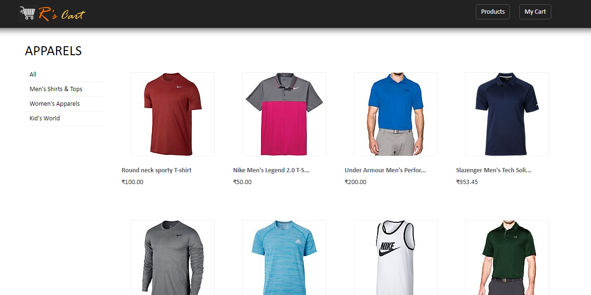
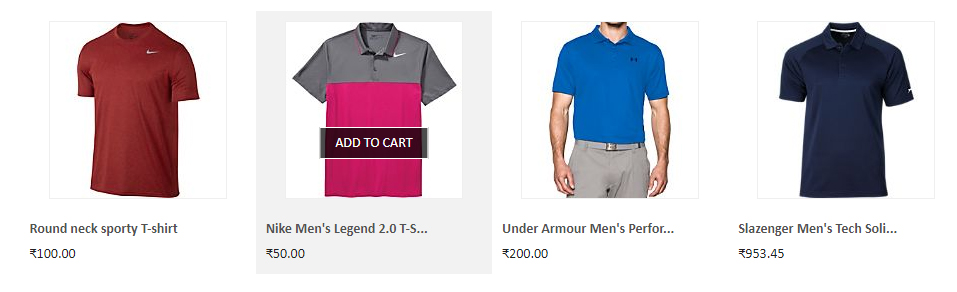
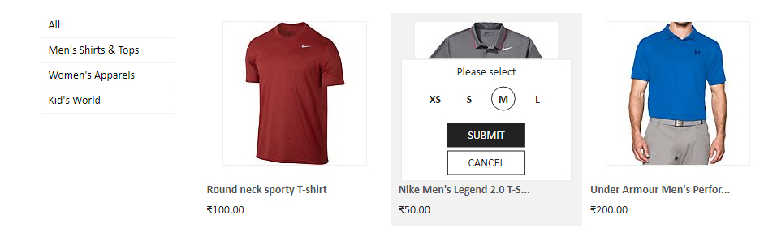
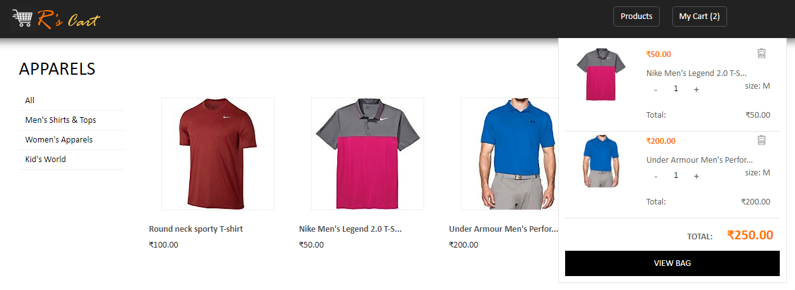
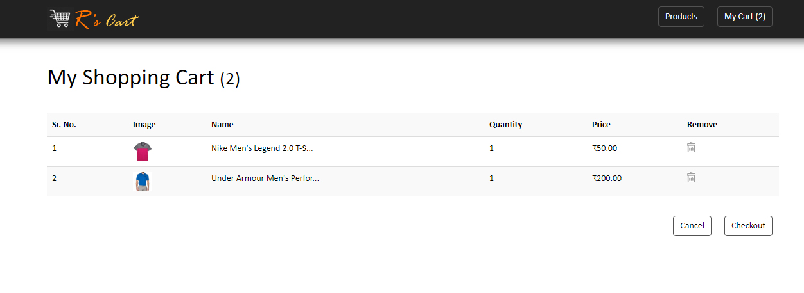

# R's Cart

An interactive angular 6 based e-shopping cart application based on JSON data (API can be invoked later). User can look for his dresses and select the size and quantity. He can preview items in mini cart and then can proceed to checkout via My Cart page.

## Demo
You may want to have a look at the demo https://r-cart.stackblitz.io/
